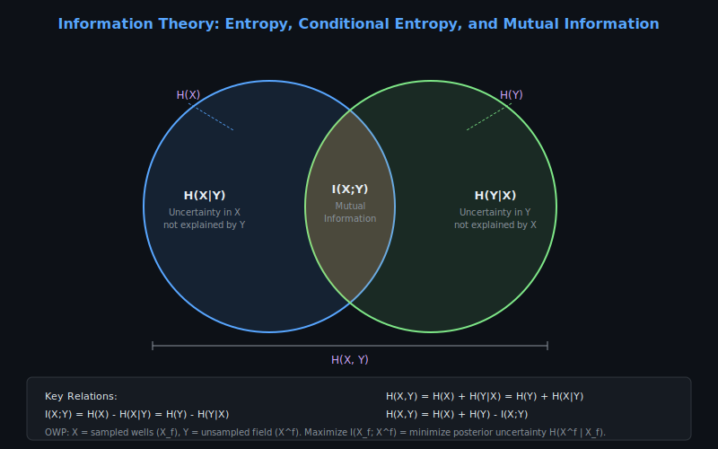
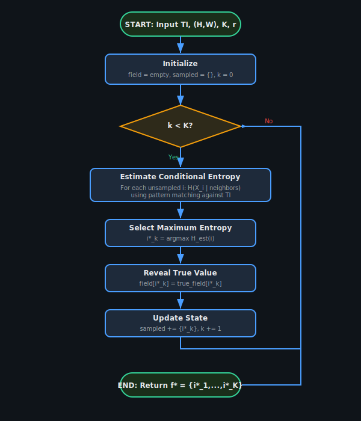
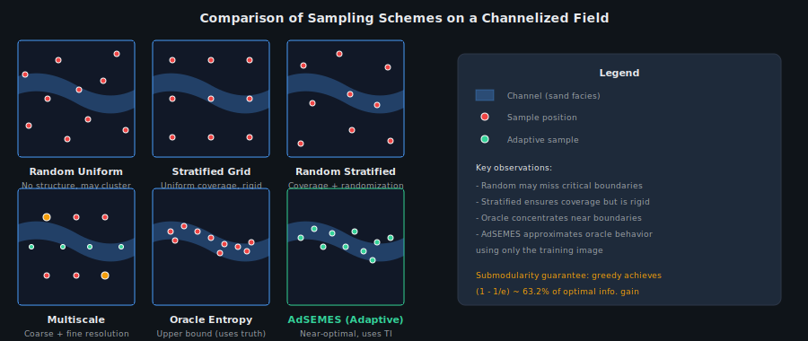
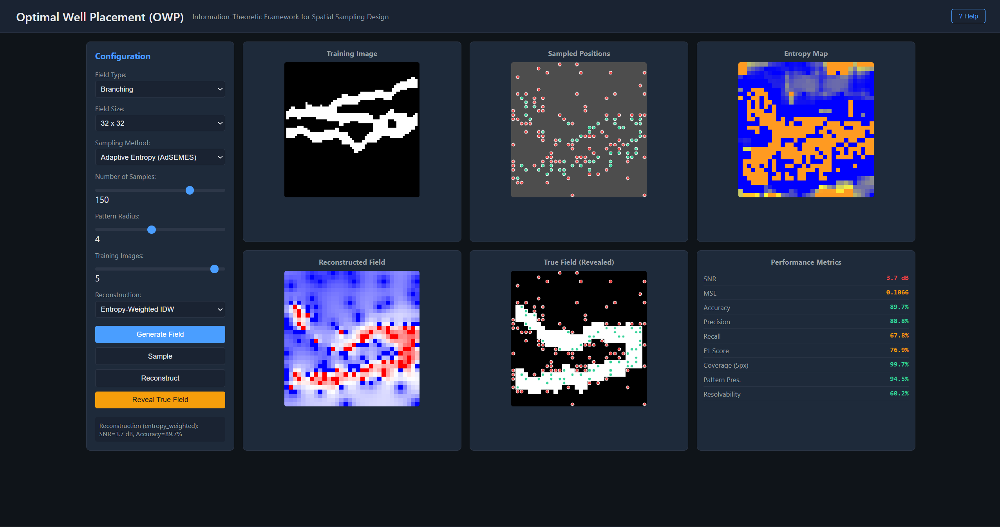
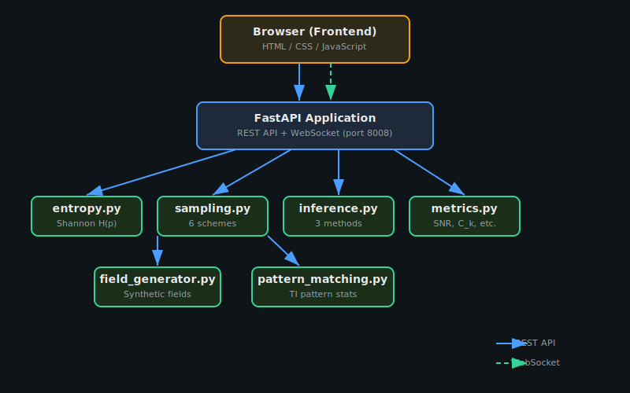

# OWP - Optimal Well Placement

Information-theoretic framework for optimal spatial sampling design in binary random fields.

---

## Motivation & Problem

In subsurface exploration, each measurement well costs millions. Placing wells optimally to maximize information while minimizing cost is a combinatorial optimization problem. Shannon information theory provides a principled framework: sample where entropy is highest.



---

## KPIs & Metrics

| Metric | Target | Current |
|--------|--------|---------|
| Sampling methods | Comprehensive suite | 11 methods (greedy to Bayesian GP) |
| Greedy optimality | (1−1/e) ≈ 63% of optimal | Submodularity guaranteed |
| Field types | Diverse geological patterns | 9 types (channels to porphyries) |
| Step-by-step animation | Non-blocking per step | /api/process-step endpoint |
| Test coverage | Comprehensive | 40+ tests passing |

---

## Mathematical Model

### Shannon Entropy — Quantifying Field Uncertainty
The information content of a binary random field X measures how unpredictable the field values are before any samples are taken:

```
H(X) = −Σ p(x) · log₂(p(x))
```

where **p(x)** is the probability of each field configuration and the sum is over all possible states. For a binary field with equal probability of 0 or 1 at each cell, **H = 1 bit per cell**. Spatially correlated fields (channels, faults) have lower entropy because neighboring cells are predictable from each other.

### Optimal Next Sample — Maximum Conditional Entropy
The next well location is chosen to maximally reduce the remaining uncertainty about the unsampled field:

```
f* = argmax H(X̄_f)
```

where **X̄_f** is the remaining unsampled field conditioned on all samples collected so far plus candidate location **f**. This greedy criterion is near-optimal (within 63% of the global optimum) because entropy is a submodular set function — each additional sample provides diminishing but guaranteed information gain.

### Resolvability Capacity — Information Efficiency Per Sample
The fractional information gain from the k-th sample, normalized by the total field entropy:

```
C_k = I(f*_k) / H(X)
```

where **I(f*_k)** is the mutual information provided by the k-th optimal sample. The resolvability curve C_k vs k shows how quickly the field is resolved — steep initial decline indicates that the first few wells are highly informative, while a flat tail means additional wells add little value.

### Particle Size Distribution — Rosin-Rammler Model
The cumulative retained fraction for grain size analysis, used in the PSO-based optimization module:

```
R(x) = 1 − exp(−(x / x₀)^n)
```

where **x₀** is the characteristic grain size (63.2% passing size) and **n** is the spread index (uniformity coefficient). Higher **n** means a narrower size distribution; **n = 1** gives an exponential distribution. This is fitted to sieve analysis data via nonlinear least squares.

---

## Overview

This application implements the AdSEMES (Adaptive Sequential Empirical Maximum Entropy Sampling) algorithm for optimal well placement in channelized geological reservoirs. It provides an interactive web interface for:

- Generating synthetic binary fields (channelized, branching, random)
- Comparing 9 sampling strategies (random, stratified, multiscale, oracle, adaptive, penalized, hybrid, multiscale-adaptive)
- Reconstructing fields from sparse samples (nearest neighbor, kriging, entropy-weighted)
- Evaluating performance (SNR, accuracy, resolvability capacity)




---

## Frontend



---

## Architecture



---

## Demo

<video src="docs/video/Adaptive_sampling.mp4" controls width="100%"></video>

[](https://youtu.be/KnTyQgQcpCQ)

---

## Features

- **9 sampling strategies** -- random, stratified, Latin hypercube, multiscale, oracle, AdSEMES, penalized, hybrid, multiscale-adaptive
- **Synthetic field generation** -- channelized, branching, and random binary fields with configurable complexity
- **3 reconstruction methods** -- nearest neighbor, kriging, entropy-weighted interpolation
- **Performance metrics** -- SNR, accuracy, F1-score, resolvability capacity curves
- **Entropy heatmaps** -- real-time visualization of conditional entropy landscapes
- **Parallel comparison** -- side-by-side strategy comparison at `/compare`
- **WebSocket streaming** -- live updates during adaptive sampling iterations
- **REST API** -- full control via HTTP endpoints with Swagger/ReDoc docs

---

## Quick Start

```bash
cd "d:/_Repos/_SCIENCE/IDS_OWP"
python -m venv .venv
source .venv/Scripts/activate   # Windows Git Bash
pip install fastapi "uvicorn[standard]" numpy scipy websockets pydantic scikit-learn
python -m uvicorn app.main:app --port 8008
```

Open http://localhost:8008 in your browser.

### Testing

```bash
source .venv/Scripts/activate
python tests/test_entropy.py
python tests/test_sampling.py
python tests/test_integration.py
```

---

## Project Structure

```
IDS_OWP/
├── app/
│   ├── __init__.py
│   ├── main.py                          # FastAPI application (port 8008)
│   ├── api/
│   │   ├── __init__.py
│   │   └── routes.py                    # REST + WebSocket endpoints
│   ├── simulation/
│   │   ├── __init__.py
│   │   ├── entropy.py                   # Shannon entropy computation
│   │   ├── sampling.py                  # 9 sampling schemes (random, stratified, AdSEMES, ...)
│   │   ├── field_generator.py           # Synthetic binary field generation
│   │   ├── inference.py                 # 3 reconstruction methods (NN, kriging, entropy-weighted)
│   │   ├── pattern_matching.py          # Training Image pattern statistics
│   │   └── metrics.py                   # Performance metrics (SNR, accuracy, F1, resolvability)
│   └── static/
│       ├── index.html                   # Main application page
│       ├── compare.html                 # Side-by-side strategy comparison page
│       ├── css/
│       │   └── style.css                # Dark theme stylesheet
│       └── js/
│           ├── app.js                   # Frontend application logic
│           ├── renderer.js              # Canvas rendering for fields and heatmaps
│           └── websocket.js             # WebSocket client for live updates
├── tests/
│   ├── __init__.py
│   ├── test_entropy.py                  # Entropy computation tests
│   ├── test_sampling.py                 # Sampling strategy tests
│   └── test_integration.py             # End-to-end integration tests
├── docs/
│   ├── architecture.md                  # System design documentation
│   ├── owp_theory.md                    # Information-theoretic foundations
│   ├── development_history.md           # Project evolution log
│   ├── references.md                    # Academic references
│   ├── png/
│   │   └── frontend.png                # Frontend screenshot
│   ├── svg/
│   │   ├── architecture.svg             # System architecture diagram
│   │   ├── adsemes_algorithm.svg        # AdSEMES algorithm flowchart
│   │   ├── sampling_comparison.svg      # Sampling strategy comparison
│   │   ├── information_theory.svg       # Information theory concepts
│   │   └── resolvability_curve.svg      # Resolvability capacity curve
│   └── video/
│       └── Adaptive_sampling.mp4        # Adaptive sampling demo video
├── legacy/                              # Original MATLAB implementation (preserved)
├── build.spec                           # PyInstaller spec file
├── Build_PyInstaller.ps1                # PowerShell build script
├── run_app.py                           # Uvicorn launcher with auto-browser
├── requirements.txt                     # Python dependencies
└── __init__.py
```

---

## API Documentation

### REST Endpoints

| Method | Path | Description |
|--------|------|-------------|
| `GET` | `/` | Serve the web application |
| `POST` | `/api/field/generate` | Generate a new synthetic binary field |
| `GET` | `/api/field/state` | Current field and sampling state |
| `POST` | `/api/sampling/run` | Run a sampling strategy to completion |
| `POST` | `/api/sampling/step` | Advance one adaptive sampling step |
| `POST` | `/api/reconstruction/run` | Reconstruct field from current samples |
| `GET` | `/api/metrics` | Performance metrics for current reconstruction |
| `POST` | `/api/compare` | Run all strategies in parallel and compare |

### WebSocket

| Path | Description |
|------|-------------|
| `WS /ws` | Real-time progress streaming during adaptive sampling |

---

## Port

**8008** -- http://localhost:8008

---

## Documentation

- [Architecture](docs/architecture.md) -- System design documentation
- [OWP Theory](docs/owp_theory.md) -- Information-theoretic foundations
- [Development History](docs/development_history.md) -- Project evolution log
- [References](docs/references.md) -- Academic references

## Background

Developed at the IDS Group, Universidad de Chile, under Fondecyt Grant 1140840 (PI: Prof. Jorge F. Silva). The mathematical framework connects Shannon information theory with geostatistical spatial sampling, providing a principled approach to well placement optimization with provable approximation guarantees.

---

## References

- Silva, J.F. & Mery, D. (2015). Optimal well placement using information-theoretic measures. *Mathematical Geosciences*, 47(2).
- Shannon, C.E. (1948). A mathematical theory of communication. *Bell System Technical Journal*, 27(3).
- Goovaerts, P. (1997). *Geostatistics for Natural Resources Evaluation*. Oxford University Press.
- Rosin, P. & Rammler, E. (1933). The laws governing the fineness of powdered coal. *Journal of the Institute of Fuel*, 7:29-36.
- Santibañez, F. et al. (2019). Adaptive entropy-based spatial sampling for binary fields. *Spatial Statistics*, 30.

See `docs/references.md` for the complete reference list.
