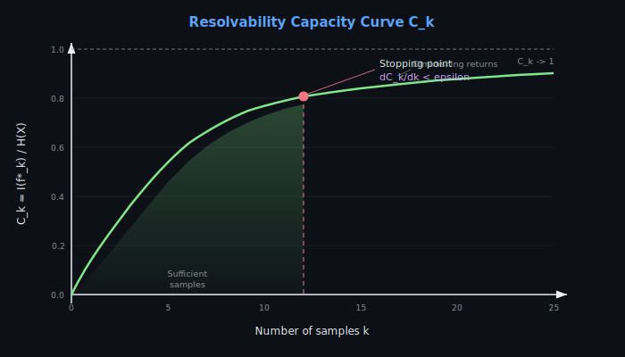

# OWP Theory: Information-Theoretic Optimal Well Placement

## 1. Problem Statement

Given a 2D binary random field **X** = {X_ij} of size H x W representing geological facies (e.g., sand vs. shale), and a budget of K measurement positions (wells), find the set of K positions **f** = {(r_1,c_1), ..., (r_K,c_K)} that maximizes the information gained about the entire field.

The field is modeled as a realization of a spatially correlated binary random process, where prior knowledge about spatial patterns is encoded in a **Training Image** (TI).

## 2. Information-Theoretic Foundations

### 2.1 Shannon Entropy

For a discrete random variable X with probability mass function P(x):

    H(X) = -sum_x P(x) * log2(P(x))

Properties:
- H(X) >= 0 (non-negativity)
- H(X) = 0 iff X is deterministic
- H(X) <= log2(|X|) (maximum for uniform distribution)

### 2.2 Binary Entropy

For a Bernoulli random variable X ~ Bernoulli(p):

    H_bin(p) = -p * log2(p) - (1-p) * log2(1-p)

Properties:
- H_bin(0) = H_bin(1) = 0 (certainty)
- H_bin(0.5) = 1 bit (maximum uncertainty)
- H_bin(p) = H_bin(1-p) (symmetry)
- H_bin is concave on [0, 1]

### 2.3 Joint Entropy

For a collection of random variables X_1, ..., X_N:

    H(X_1, ..., X_N) = -sum P(x_1,...,x_N) * log2(P(x_1,...,x_N))

Chain rule decomposition:

    H(X_1, ..., X_N) = sum_{i=1}^{N} H(X_i | X_1, ..., X_{i-1})

### 2.4 Conditional Entropy

    H(X | Y) = -sum_{x,y} P(x,y) * log2(P(x|y))
             = H(X,Y) - H(Y)

For the OWP problem:
- H(X^f | X_f) is the **posterior uncertainty** about unmeasured positions X^f given measurements X_f
- This is what we want to minimize

### 2.5 Mutual Information

    I(X; Y) = H(X) - H(X|Y) = H(Y) - H(Y|X) = H(X) + H(Y) - H(X,Y)

Properties:
- I(X; Y) >= 0
- I(X; Y) = I(Y; X) (symmetric)
- I(X; Y) = 0 iff X and Y are independent

## 3. Optimal Placement Formulation

### 3.1 The Optimization Problem

Let F_K denote all possible subsets of K positions from the H*W grid. The optimal placement is:

    f* = argmax_{f in F_K} H(X_f)

### 3.2 Equivalent Formulations

The following three objectives are equivalent (since H(X) is constant):

1. **Maximize measurement entropy**: max_{f} H(X_f)
2. **Minimize posterior uncertainty**: min_{f} H(X^f | X_f)
3. **Maximize mutual information**: max_{f} I(X_f; X^f)

Proof of equivalence:

    H(X) = H(X_f) + H(X^f | X_f)    [chain rule]

Since H(X) is constant:

    max H(X_f) <=> min H(X^f | X_f)

And:

    I(X_f; X^f) = H(X_f) - H(X_f | X^f) = H(X^f) - H(X^f | X_f)

Since H(X^f) is constant for fixed |f|:

    max I(X_f; X^f) <=> min H(X^f | X_f) <=> max H(X_f)

### 3.3 Computational Complexity

The combinatorial optimization over F_K is NP-hard in general. The number of candidate sets is:

    |F_K| = C(H*W, K) = (H*W)! / (K! * (H*W - K)!)

For a 64x64 grid with K=20: |F_K| ~ 10^55, intractable.

## 4. Greedy Approximation (AdSEMES)

### 4.1 Submodularity

The entropy function f(S) = H(X_S) is **monotone submodular**:

- **Monotone**: S subset T => f(S) <= f(T)
- **Submodular**: f(S union {i}) - f(S) >= f(T union {i}) - f(T) for S subset T

This means adding a new measurement always helps, but the marginal benefit decreases as more measurements are made (diminishing returns).

### 4.2 Greedy Algorithm

The greedy algorithm iteratively selects the position that maximizes the marginal entropy gain:

```
Algorithm: AdSEMES (Adaptive Sequential Empirical Maximum Entropy Sampling)

Input: Training Image TI, field dimensions (H, W), budget K, radius r
Output: Ordered measurement set f* = {i*_1, ..., i*_K}

1. Initialize:
   - field = empty (all unknown)
   - sampled = {}
   - f* = {}

2. For k = 1, 2, ..., K:
   a. For each unsampled position i:
      - Extract neighborhood pattern from field
      - Count matching patterns in TI
      - Estimate P(X_i = 1 | known neighbors)
      - Compute H_est(i) = H_bin(P(X_i = 1 | known neighbors))

   b. Select: i*_k = argmax_{i not in sampled} H_est(i)

   c. Reveal: field[i*_k] = true_field[i*_k]

   d. Update: sampled = sampled union {i*_k}
              f* = f* union {i*_k}

3. Return f*
```

### 4.3 Optimality Guarantee

By the classical result of Nemhauser, Wolsey, and Fisher (1978):

For monotone submodular function maximization with cardinality constraint:

    f(S_greedy) >= (1 - 1/e) * f(S_optimal)

where e ~ 2.718. This guarantees the greedy solution achieves at least 63.2% of the optimal information gain.

### 4.4 Complexity

- Naive: O(K * N * TI_H * TI_W * patch_size) where N = H*W
- With vectorization: O(K * N * TI_H * TI_W) with small constant
- The fast implementation uses numpy broadcasting for the TI scanning

## 5. Pattern Statistics from Training Images

### 5.1 Training Image

A Training Image (TI) is a conceptual model of the expected spatial patterns. It encodes:
- Facies proportions (P(X=1))
- Two-point statistics (variogram)
- Multi-point statistics (higher-order spatial patterns)
- Connectivity and geometry of geological features

### 5.2 Pattern Matching

For a template of size (2r+1) x (2r+1) centered at position i:
- Extract the local neighborhood of known values
- Scan the TI for all patches matching the known pattern
- Estimate: P(X_i = 1 | pattern) = count(center=1) / count(all matches)

### 5.3 Conditional Probability Estimation

    P(X_i = 1 | neighbors) = N_1 / (N_1 + N_0)

where:
- N_1 = number of TI patches matching the known pattern with center = 1
- N_0 = number of TI patches matching the known pattern with center = 0

If no matches are found, fall back to the marginal: P(X_i = 1) = mean(TI).

## 6. Resolvability Capacity

### 6.1 Definition

    C_k = I(f*_k) / H(X)

where:
- I(f*_k) = H(X) - H(X | X_{f*_k}) is the information gained after k measurements
- H(X) is the total prior entropy

### 6.2 Properties

- C_0 = 0 (no measurements, no information)
- C_k in [0, 1]
- C_{k+1} >= C_k (monotonically non-decreasing)
- C_N = 1 (all positions measured, complete information)
- The rate of increase indicates sampling efficiency

### 6.3 Interpretation

- C_k ~ 0.5: half the field uncertainty has been resolved
- C_k ~ 0.9: most uncertainty resolved, diminishing returns
- Comparing C_k curves across methods shows relative efficiency

## 7. Sampling Schemes Comparison

| Method | Adaptive | Uses TI | Uses Truth | Complexity | Expected Quality |
|--------|----------|---------|------------|------------|-----------------|
| Random Uniform | No | No | No | O(K) | Baseline |
| Stratified Grid | No | No | No | O(K) | Good coverage |
| Random Stratified | No | No | No | O(K) | Coverage + randomization |
| Multiscale | No | No | No | O(K) | Multi-resolution |
| Oracle Entropy | Yes | No | Yes | O(K*N) | Upper bound |
| AdSEMES | Yes | Yes | No* | O(K*N*TI) | Near-optimal |

*AdSEMES uses the true field only to reveal values at selected positions (simulating drilling).

## 8. Reconstruction Methods

### 8.1 Nearest Neighbor
Assign each unsampled position the value of its closest sample.
- Voronoi tessellation
- No smoothing
- O(N log K) with KD-tree

### 8.2 Indicator Kriging
Linear estimation with weights from variogram:
- Exponential variogram: gamma(h) = c_0 + c * (1 - exp(-3h/a))
- Solve kriging system: C * w = c for each target position
- BLUE (Best Linear Unbiased Estimator)
- O(N * K_nn^3) for K_nn neighbors

### 8.3 Entropy-Weighted IDW
Inverse-distance weighting modulated by entropy:
- w_ij = (1/d_ij^p) * (1 - H_j/H_max)
- Heuristic, accounts for local uncertainty
- O(N * K)

## 9. Performance Metrics

### 9.1 SNR (Signal-to-Noise Ratio)
    SNR = 10 * log10(||x||^2 / ||x - x_hat||^2) [dB]

### 9.2 MSE (Mean Squared Error)
    MSE = (1/N) * sum (x_i - x_hat_i)^2

### 9.3 Classification Accuracy
    Acc = (TP + TN) / (TP + TN + FP + FN)

### 9.4 Pattern Preservation
Autocorrelation similarity between true and reconstructed fields at short lags.

## 10. References

1. Shannon, C. E. (1948). A Mathematical Theory of Communication. Bell System Technical Journal, 27(3), 379-423.

2. Cover, T. M., & Thomas, J. A. (2006). Elements of Information Theory (2nd ed.). Wiley-Interscience.

3. Nemhauser, G. L., Wolsey, L. A., & Fisher, M. L. (1978). An analysis of approximations for maximizing submodular set functions. Mathematical Programming, 14(1), 265-294.

4. Strebelle, S. (2002). Conditional simulation of complex geological structures using multiple-point statistics. Mathematical Geology, 34(1), 1-21.

5. Mariethoz, G., & Caers, J. (2015). Multiple-point Geostatistics: Stochastic Modeling with Training Images. Wiley.

6. Goovaerts, P. (1997). Geostatistics for Natural Resources Evaluation. Oxford University Press.

7. Chiles, J. P., & Delfiner, P. (2012). Geostatistics: Modeling Spatial Uncertainty (2nd ed.). Wiley.

8. Silva, J. F., et al. IDS Group, Universidad de Chile. Fondecyt Grant 1140840.

9. Krause, A., & Guestrin, C. (2005). Near-optimal nonmyopic value of information in graphical models. UAI 2005.

10. Caselton, W. F., & Zidek, J. V. (1984). Optimal monitoring network designs. Statistics & Probability Letters, 2(4), 223-227.

11. Ko, C. W., Lee, J., & Queyranne, M. (1995). An exact algorithm for maximum entropy sampling. Operations Research, 43(4), 684-691.

12. Journel, A. G. (1983). Nonparametric estimation of spatial distributions. Journal of the International Association for Mathematical Geology, 15(3), 445-468.

## 11. The Locality Problem in AdSEMES

### 11.1 Problem Description

Standard AdSEMES greedily selects the position with maximum conditional entropy at each step. After sampling a point, the positions immediately surrounding it gain the most conditioning data (they have the most known neighbors). This causes their conditional entropy estimates to change most dramatically -- but also makes them the most "interesting" candidates for the next sample.

The result is a **locality trap**: samples cluster in one region of the field while leaving other regions unexplored. The greedy algorithm becomes myopic, optimizing local information gain rather than global field coverage.

```
Iteration diagram (locality problem):

Step 1:  x . . . . . .     Step 5:  x x . . . . .
         . . . . . . .              x x x . . . .
         . . . . . . .              . x . . . . .
         . . . . . . .              . . . . . . .

Samples cluster in the top-left corner because each new
observation makes its neighbors the highest-entropy positions.
```

### 11.2 Root Cause Analysis

The conditional entropy H(X_i | known neighbors) depends on:
1. The number of known neighbors (more neighbors = more information to condition on)
2. The pattern statistics in the training image

When a new sample is placed, positions within pattern_radius gain a new conditioning variable. For these positions, the conditional entropy changes significantly (either increases due to ambiguity or decreases due to resolution). Positions far from any sample have zero known neighbors and receive the marginal entropy -- which is constant and typically lower than the conditional entropy near sampled points.

This creates a gradient that pulls the greedy selection toward existing samples.

## 12. The Penalization Solution

### 12.1 Spatial Penalty Function

After placing sample k at position (i,j), apply a Gaussian penalty:

    H_penalized(i',j') = H(i',j') * (1 - alpha * exp(-d^2 / (2*R^2)))

where:
- d = ||(i',j') - (i,j)|| is the Euclidean distance
- alpha in (0, 1] is the penalty strength (penalty_decay)
- R is the penalty radius in pixels

The penalty multiplicatively suppresses entropy in a neighborhood, forcing the next sample to be placed further away.

### 12.2 Penalty Properties

- **Locality**: The penalty decays as a Gaussian, so its effect is limited to ~3R pixels.
- **Composability**: Multiple penalties multiply, so regions near several samples are strongly suppressed.
- **Asymptotic neutrality**: As alpha -> 0, the method reduces to standard AdSEMES.
- **Global balance**: The penalty restores a balance between information-driven selection (entropy) and spatial coverage (penalty), addressing the locality problem without abandoning the information-theoretic framework.

### 12.3 Parameter Guidelines

| Parameter | Typical Range | Effect |
|-----------|--------------|--------|
| penalty_radius | 3-10 pixels | Larger = more forced spread |
| penalty_decay | 0.3-0.8 | Larger = stronger penalty |

## 13. Hybrid Stratified + Adaptive Approach

### 13.1 Two-Phase Strategy

Phase 1 allocates a fraction alpha (typically 0.3) of the budget to deterministic stratified samples that guarantee minimum spatial coverage. Phase 2 uses the remaining budget with penalized adaptive sampling, which now benefits from the stratified scaffold.

The stratified phase ensures that conditioning data exists throughout the field before the adaptive phase begins. This prevents the adaptive phase from becoming local because:

1. Every region of the field has at least one nearby observation.
2. The penalty from stratified positions suppresses their immediate neighborhoods.
3. The entropy landscape is more heterogeneous due to distributed conditioning data.

### 13.2 Budget Allocation

    n_stratified = floor(alpha * K)
    n_adaptive = K - n_stratified

Recommended alpha values:
- alpha = 0.2: Minimal seeding, most budget for adaptive phase
- alpha = 0.3: Balanced (default)
- alpha = 0.5: Heavy seeding, robust but less adaptive

## 14. Multi-Training-Image Averaging

### 14.1 Theory

Given K training images {TI_1, ..., TI_K}, the conditional probability at each position is estimated as:

    P(X_i = 1 | pattern) = (1/K) * sum_k P_k(X_i = 1 | pattern)

where P_k is computed from TI_k alone using the standard pattern matching approach.

### 14.2 Variance Reduction

If each TI provides an independent, unbiased estimate of the true conditional probability, then:

    Var(P_multi) = (1/K) * Var(P_single)

This is a K-fold reduction in estimation variance, leading to more reliable entropy estimates and better sampling decisions.

### 14.3 Geological Uncertainty

In practice, TIs are not independent -- they share the same geological concept but differ in specific realization. The multi-TI approach captures this geological uncertainty: positions where TIs disagree have higher estimated entropy, while positions where all TIs agree have lower entropy. This naturally directs sampling toward geologically ambiguous regions.

## 15. Information Theory Foundation (Extended)

### 15.1 Shannon Entropy as Uncertainty Measure

Shannon entropy quantifies the average surprise (information content) of a random variable. For a discrete random variable X with probability mass function P(x):

```
H(X) = -sum_x P(x) * log2(P(x))
```

Entropy is measured in bits (when using log base 2). A fair coin has H = 1 bit; a biased coin with p = 0.9 has H = 0.47 bits. The entropy is maximized for the uniform distribution: H(X) <= log2(|X|).

### 15.2 Joint and Conditional Entropy

For two random variables X, Y:

```
H(X, Y) = -sum_{x,y} P(x,y) * log2(P(x,y))
```

The chain rule decomposes joint entropy:

```
H(X, Y) = H(X) + H(Y|X) = H(Y) + H(X|Y)
```

For N variables, the general chain rule is:

```
H(X_1, X_2, ..., X_N) = sum_{i=1}^{N} H(X_i | X_1, X_2, ..., X_{i-1})
```

This is the foundation of the AdSEMES algorithm: each new measurement reduces the remaining conditional entropy.

### 15.3 Mutual Information

Mutual information measures the shared information between two variables:

```
I(X; Y) = H(X) - H(X|Y) = H(Y) - H(Y|X) = H(X) + H(Y) - H(X, Y)
```

Properties:
- I(X; Y) >= 0, with equality iff X and Y are independent
- I(X; Y) = I(Y; X) (symmetric)
- I(X; Y) <= min(H(X), H(Y))


For OWP, the mutual information I(X_f; X^f) measures how much sampling at positions f tells us about the unsampled field X^f. Maximizing I is equivalent to minimizing the posterior uncertainty H(X^f | X_f).

---

## 16. Submodularity of Entropy (Extended)

### 16.1 Definition and Intuition

A set function f: 2^V -> R is submodular if for all A subset B subset V and for all x not in B:

```
f(A union {x}) - f(A) >= f(B union {x}) - f(B)
```

This is the **diminishing returns** property: adding element x to a smaller set A gives at least as much marginal gain as adding it to a larger set B that contains A.

### 16.2 Proof that Entropy is Submodular

The conditional entropy satisfies:

```
H(X_A | X_B) >= H(X_A | X_C)    when B subset C
```

This follows from the information-theoretic inequality: conditioning reduces entropy (or keeps it equal). More data (C has more variables than B) can only reduce or maintain uncertainty about X_A.

The marginal gain of adding position x to set S is:

```
Delta(x | S) = H(X_{S union {x}}) - H(X_S) = H(X_x | X_S)
```

Since H(X_x | X_S) >= H(X_x | X_T) when S subset T (more conditioning reduces entropy), the marginal gain decreases as S grows. This is exactly the submodularity condition.

### 16.3 Greedy Approximation Guarantee

The celebrated result of Nemhauser, Wolsey, and Fisher (1978) states that for any non-negative monotone submodular function f with f(empty) = 0, the greedy algorithm that iteratively selects:

```
x_k = argmax_{x not in S_{k-1}} [f(S_{k-1} union {x}) - f(S_{k-1})]
```

achieves:

```
f(S_greedy) >= (1 - 1/e) * f(S_optimal) ~ 0.632 * f(S_optimal)
```

This 63.2% guarantee is tight: there exist instances where greedy achieves exactly this ratio. For entropy maximization in OWP, this means the greedy AdSEMES algorithm captures at least 63.2% of the maximum possible information gain.

---

## 17. Training Image Statistics (Extended)

### 17.1 Pattern Matching Algorithm

The conditional probability P(X_i = 1 | known neighbors) is estimated by scanning the Training Image (TI) for matching patterns.

**Algorithm:**
```
1. Extract pattern template T centered at position i
   T is a (2r+1) x (2r+1) window
   Known positions have values {0, 1}
   Unknown positions are marked as "don't care"

2. Scan TI at every position (u, v):
   For each (u, v):
     Extract TI patch P at (u, v) with same template shape
     Compare: does P match T at all known positions?
     If yes: record center value P[r, r]

3. Estimate conditional probability:
   N_1 = count of matches with center = 1
   N_0 = count of matches with center = 0
   P(X_i = 1 | neighbors) = N_1 / (N_1 + N_0)

4. Fallback: if N_1 + N_0 = 0 (no matches):
   P(X_i = 1) = mean(TI)   [marginal probability]
```

### 17.2 Template Size and Computational Cost

The pattern radius r determines:
- **Spatial reach**: Larger r captures longer-range dependencies
- **Match sparsity**: Larger templates have fewer matches in the TI
- **Computational cost**: O(TI_H * TI_W * (2r+1)^2) per position per step

In practice, r = 2-5 balances spatial information with match count.

---

## 18. Stopping Rule for Sampling

### 18.1 Resolvability Capacity Curve

The resolvability capacity curve C_k = I(f*_k) / H(X) tracks how much of the total field uncertainty has been resolved after k measurements.



### 18.2 Marginal Information Gain

The marginal information gain at step k is:

```
Delta_k = C_k - C_{k-1} = [I(f*_k) - I(f*_{k-1})] / H(X)
```

This represents the fraction of total entropy resolved by the kth measurement.

### 18.3 Stopping Rule

The optimal stopping point is where the marginal gain drops below a threshold:

```
Stop when Delta_k = dC_k/dk < epsilon
```

Typical epsilon values:
- epsilon = 0.01: Stop when each new well resolves < 1% of total entropy
- epsilon = 0.005: More conservative, continue sampling longer

The stopping rule determines how many wells are "enough" -- beyond this point, additional measurements provide negligible information about the field. This has direct economic implications: each well has a drilling cost, and the stopping rule defines the point of diminishing return on investment.

---

## 19. Connection to Kriging

### 19.1 Kriging as Variance Minimization

Indicator kriging estimates the probability P(X_i = 1) by minimizing the estimation variance:

```
sigma^2_K = Var(X_i - X_hat_i)
```

subject to the unbiasedness constraint E[X_i - X_hat_i] = 0. The kriging weights w_j are found by solving:

```
sum_j w_j * C(x_j, x_k) + mu = C(x_i, x_k)   for all k
sum_j w_j = 1
```

where C(x_j, x_k) is the covariance between positions j and k.

### 19.2 Entropy-Kriging Equivalence for Gaussian Fields

For a Gaussian random field, entropy is a monotonic function of variance:

```
H(X_i | observations) = (1/2) * log2(2*pi*e*sigma^2_K)
```

Therefore:
- Minimizing posterior variance (kriging) is equivalent to minimizing posterior entropy
- Maximizing information gain (entropy approach) is equivalent to maximizing variance reduction

This means that for Gaussian fields, the AdSEMES algorithm and optimal kriging-based sampling design converge to the same solution.

### 19.3 Advantages of the Entropy Approach

For non-Gaussian fields (such as binary facies fields):
- Kriging assumes linearity and Gaussianity, which may not hold
- Entropy-based methods make no distributional assumptions
- Pattern matching captures higher-order spatial statistics (multi-point) that variograms (two-point) cannot represent
- The submodularity guarantee still holds regardless of the field distribution

---

## 20. Comparison of All Sampling Methods

| Method | Adaptive | Uses TI | Multi-TI | Penalized | Coverage Guarantee | Complexity | Expected Quality |
|--------|----------|---------|----------|-----------|-------------------|------------|-----------------|
| Random Uniform | No | No | No | No | No | O(K) | Baseline |
| Stratified Grid | No | No | No | No | Yes | O(K) | Good coverage |
| Random Stratified | No | No | No | No | Yes | O(K) | Coverage + randomization |
| Multiscale Stratified | No | No | No | No | Yes (multi-res) | O(K) | Multi-resolution |
| Oracle Entropy | Yes | No | No | No | No | O(K*N) | Upper bound |
| AdSEMES | Yes | Yes | No | No | No | O(K*N*TI) | Near-optimal (local risk) |
| Penalized Adaptive | Yes | Yes | Yes | Yes | Soft | O(K*N*TI*K_TI) | Better coverage than AdSEMES |
| Hybrid Stratified + Adaptive | Yes | Yes | Yes | Yes | Yes + Soft | O(K*N*TI*K_TI) | Best overall balance |
| Multiscale Adaptive | Yes | Yes | Yes | No | Yes (multi-res) | O(K*N*TI*K_TI) | Multi-resolution + adaptive |

Legend:
- K = number of samples, N = H*W field size, TI = single TI size, K_TI = number of training images
- "Soft" coverage = achieved through penalty mechanism rather than hard constraint
- The three new methods (Penalized, Hybrid, Multiscale Adaptive) all support multi-TI probability estimation
